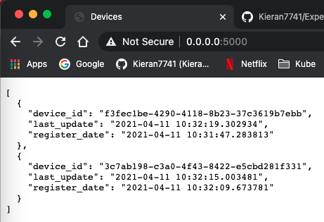

# Experimenting with MicroPython on the ESP32

Python is my main programing language and I also want to play around embedded devices. MicroPython is therefore 
the perfect starting point. I have previously messed around with Arduinos while in college but disliked the `C` syntax. 

The aim for this repo is to document my experimentation with MicroPython and hopefully create some cool projects.

Make sure to clone this repo: `git clone https://github.com/Kieran7741/ExperimentingWithMicroPython.git`

### Setting up your enviornment to work with ESP32 on Mac

The following driver needs to be installed to communicate with the ESP32 on Mac: 
https://www.silabs.com/developers/usb-to-uart-bridge-vcp-drivers

Running `ls /dev/tty.*` should return something like
```commandline
/dev/tty.Bluetooth-Incoming-Port	
/dev/tty.SLAB_USBtoUART #ESP32
/dev/tty.usbserial-0001 #ESP32
```
Both of the above marked ports can now be used to communicate with the ESP32

#### Get Micropython onto your board
Download a `micropython` binary from [here](https://micropython.org/download/esp32/). Select the latest stable release.

Using `pip` you should now install the `esptool`. This allows you to write the `micropython` bin to your `ESP32`.
Run the following commands:
```commandline
# Clear the boards flash
esptool.py --port /dev/tty.SLAB_USBtoUART erase_flash

# Write the previously downloaded micropython bin to the board
esptool.py --chip esp32 --port /dev/tty.SLAB_USBtoUART write_flash -z 0x1000 /Users/kieran/Downloads/esp32-idf4-20210202-v1.14.bin    
```

*Sample output*
```commandline
esp32_testing % esptool.py --port /dev/tty.SLAB_USBtoUART erase_flash                                                                                                                 (master)esp32_testing
esptool.py v3.0
Serial port /dev/tty.SLAB_USBtoUART
Connecting........_____....._
Detecting chip type... ESP32
Chip is ESP32-D0WD (revision 1)
Features: WiFi, BT, Dual Core, 240MHz, VRef calibration in efuse, Coding Scheme None
Crystal is 40MHz
MAC: fc:f5:c4:55:4d:9c
Uploading stub...
Running stub...
Stub running...
Erasing flash (this may take a while)...
Chip erase completed successfully in 8.6s
Hard resetting via RTS pin...

esp32_testing % esptool.py --chip esp32 --port /dev/tty.SLAB_USBtoUART write_flash -z 0x1000 /Users/kieran/Downloads/esp32-idf4-20210202-v1.14.bin                                    (master)esp32_testing
esptool.py v3.0
Serial port /dev/tty.SLAB_USBtoUART
Connecting........_
Chip is ESP32-D0WD (revision 1)
Features: WiFi, BT, Dual Core, 240MHz, VRef calibration in efuse, Coding Scheme None
Crystal is 40MHz
MAC: fc:f5:c4:55:4d:9c
Uploading stub...
Running stub...
Stub running...
Configuring flash size...
Compressed 1484624 bytes to 951640...
Wrote 1484624 bytes (951640 compressed) at 0x00001000 in 84.1 seconds (effective 141.1 kbit/s)...
Hash of data verified.

Leaving...
Hard resetting via RTS pin...
```

You should now be able to connect to your board and run micropython. Run the following command to connect:
```
screen /dev/tty.SLAB_USBtoUART 115200
```
This should allow you to interact with the micropython REPL on your board. 
 
### Run your python file on the ESP32

To copy python code to the board use `ampy`. Github repo [here](https://github.com/scientifichackers/ampy)
```commandline
# Install with pip
pip install adafruit-ampy

# List files on your board
ampy --port /dev/tty.SLAB_USBtoUART ls
```

The following command runs [hello.py](hello.py) on your ESP32 
```commandline
ampy --port /dev/tty.SLAB_USBtoUART run hello.py                                                                                                                      (master)esp32_testing
hello from inside a ESP32
```

### Connect to WIFI

The ESP32 has built in WIFI and Bluetooth. You can easily connect to WIFI using the following function. 
Note this function has been taken from [Miguel Grinberg](https://blog.miguelgrinberg.com/post/micropython-and-the-internet-of-things-part-iv-wi-fi-and-the-cloud). 
He provides great tutorials on his blog and is the writer of [Flask Web Development](https://www.amazon.co.uk/Flask-Web-Development-Developing-Applications/dp/1449372627)

```python
import network
import time

def connect_wifi(ssid, password):
    ap_if = network.WLAN(network.AP_IF)
    ap_if.active(False)
    sta_if = network.WLAN(network.STA_IF)
    if not sta_if.isconnected():
        print('Connecting to WiFi...')
        sta_if.active(True)
        sta_if.connect(ssid, password)
        while not sta_if.isconnected():
            time.sleep(1)
    print('Network config:', sta_if.ifconfig())
```

### Making requests

`urequests` can be used to make HTTP requests. When working with urequests I found it necessary to manually close the socket. 
After about 10 requests a `OSError: 23` was thrown. After some digging around it is caused by urequests 
not closing sockets. Checkout this [thread](https://forum.pycom.io/topic/1747/urequests-with-ussl-causes-an-oserror/6) for more info   

A simple fix is to wrap urequests get method as shown below.
```python

import urequests

def get(endpoint):
    res = urequests.get(endpoint)
    res.close()
    return res
```

### Sending requests to a locally running Flask server

One main reason I bought the ESP32 is to have it interfacing with a web server running on a Raspberry Pi to 
provide constant feedback of some description. A basic `Flask` server is provided in [app.py](iot_server/app.py).
This simple `Flask` server allows an ESP32 to register with the web server. Each ESP32 can then send updates to the server.

Update the following variables in [contact_server.py](contact_server.py)
```
SSID = '<ROUTER_SSID>'  # Add your Routers name here
PASSWORD = '<ROUTER_PASSWORD>'  # Add your Routers password here
SERVER_IP = '192.168.8.103'  # Update with your laptops IP
SERVER_PORT = '5000'  # Update with Flask servers port
```

Copy [contact_server.py](contact_server.py) to your ESP32 and then start up the flask app. 
**Note**: Make sure you have Flask installed: `pip install flask`
```commandline
# Copy contact_server.py to ESP32:
ampy --port /dev/tty.SLAB_USBtoUART put contact_server.py main.py
# Start web server
cd iot_server && python app.py
```
```commandline
# Device 1 registering with the server
192.168.8.109 - - [11/Apr/2021 10:04:08] "GET /register HTTP/1.0" 200 -
# Device 1 sending update
192.168.8.109 - - [11/Apr/2021 10:04:08] "GET /status_update/d6eaeced-4634-45a7-90cb-05a6eeea74f0 HTTP/1.0" 200 -
192.168.8.109 - - [11/Apr/2021 10:04:13] "GET /status_update/d6eaeced-4634-45a7-90cb-05a6eeea74f0 HTTP/1.0" 200 -
# Device 2 registering with the server
192.168.8.108 - - [11/Apr/2021 10:04:16] "GET /register HTTP/1.0" 200 -
192.168.8.109 - - [11/Apr/2021 10:04:18] "GET /status_update/d6eaeced-4634-45a7-90cb-05a6eeea74f0 HTTP/1.0" 200 -
# Device 2 sending update
192.168.8.108 - - [11/Apr/2021 10:04:19] "GET /status_update/20e572db-438e-4245-8660-d72d035243fc HTTP/1.0" 200 -
192.168.8.109 - - [11/Apr/2021 10:04:24] "GET /status_update/d6eaeced-4634-45a7-90cb-05a6eeea74f0 HTTP/1.0" 200 -
192.168.8.108 - - [11/Apr/2021 10:04:24] "GET /status_update/20e572db-438e-4245-8660-d72d035243fc HTTP/1.0" 200 -
```

The server allows a device to register and assigns it a UUID to be used in later requests

```python
@app.route('/register', methods=['POST'])
def register_device():
    """
    Register device data with the server
    :return: UUID for device
    """

    device_details = {'device_id': str(uuid4()), 'register_date': str(datetime.now()), 'last_update': str(datetime.now())}
    devices.append(device_details)
    return jsonify(device_details)
``` 

The ESP32 can then register with the Flask server and update its status every 5 seconds.

```python
if __name__ == '__main__':
    connect_wifi(SSID, PASSWORD)
    uuid = register()
    while True:
        try:
            get(SERVER_URL.format(SERVER_IP=SERVER_IP, SERVER_PORT=SERVER_PORT, 
                                  ENDPOINT='status_update/{0}'.format(uuid)))
        except:
            pass
        time.sleep(5)

```

#### View registered devices in your Browser

Visit [http://0.0.0.0:5000/](http://0.0.0.0:5000/) to view all registered devices


